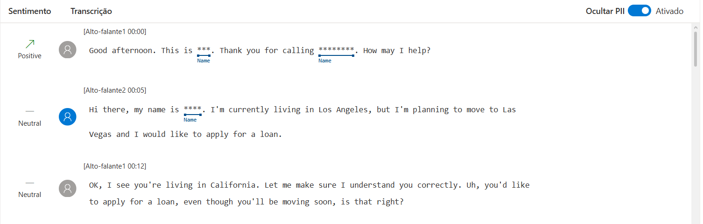

# Azure AI Speech Studio & Language Studio – Laboratório Prático

## 📌 Descrição do Projeto
Este repositório documenta a prática realizada com os serviços **Azure Speech Studio** e **Azure Language Studio**, com foco em análise de fala e processamento de linguagem natural.  
O objetivo é consolidar os conceitos aprendidos durante o curso e registrar insights técnicos obtidos a partir do uso prático das ferramentas de IA do Azure.

---

## 🎯 Objetivos de Aprendizagem
- Compreender o funcionamento dos serviços de fala e linguagem do Azure  
- Aplicar conceitos de IA em um ambiente prático  
- Documentar processos técnicos de forma clara  
- Utilizar o GitHub como ferramenta de compartilhamento de conhecimento técnico  

---

## 🗣️ Azure Speech Studio

### 🔹 Funcionalidade Testada: Speech to Text
O serviço de **Speech to Text** permite converter fala em texto utilizando modelos de reconhecimento de voz baseados em IA.

**Passos realizados:**
1. Acesso ao Azure Speech Studio
2. Utilização da funcionalidade de transcrição de áudio
3. Análise do texto gerado automaticamente

**Possíveis aplicações:**
- Bots de atendimento
- Legendas automáticas
- Acessibilidade
- Transcrição de reuniões

📸 Exemplo de teste realizado:

---

## 🧠 Azure Language Studio

### 🔹 Análise de Sentimento
A análise de sentimento permite identificar se um texto expressa uma opinião positiva, negativa ou neutra.

**Exemplo de uso:**
- Avaliações de clientes
- Feedbacks
- Monitoramento de redes sociais

---

### 🔹 Extração de Frases-chave
Essa funcionalidade identifica os principais conceitos de um texto não estruturado.

**Exemplo de uso:**
- Resumo de documentos
- Identificação de tópicos relevantes
- Análise de conteúdo textual

---

## 📚 Insights e Aprendizados
- Os serviços do Azure AI são acessíveis via interface web e APIs REST  
- Speech Studio e Language Studio permitem rápida validação de ideias  
- A documentação clara facilita reutilização e estudos futuros  
- Essas soluções são facilmente integráveis a bots, sistemas corporativos e aplicações web  

---

## 🔗 Links Úteis
- Speech Studio: https://speech.microsoft.com  
- Language Studio: https://language.cognitive.azure.com  
- Documentação Azure AI: https://learn.microsoft.com/azure/ai-services  

---

## ✅ Conclusão
Este laboratório permitiu compreender de forma prática como os serviços de fala e linguagem do Azure funcionam, reforçando conceitos teóricos e demonstrando o potencial da IA aplicada a soluções reais.
